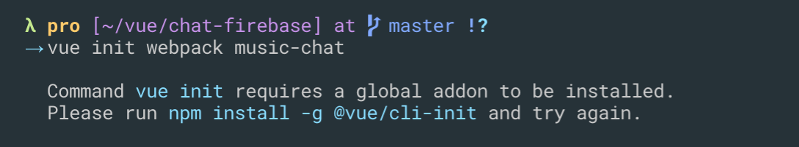
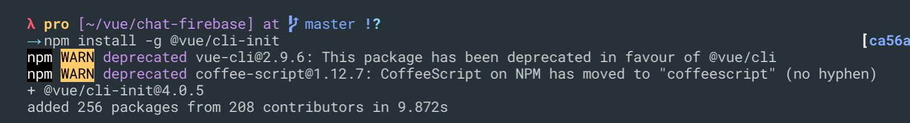
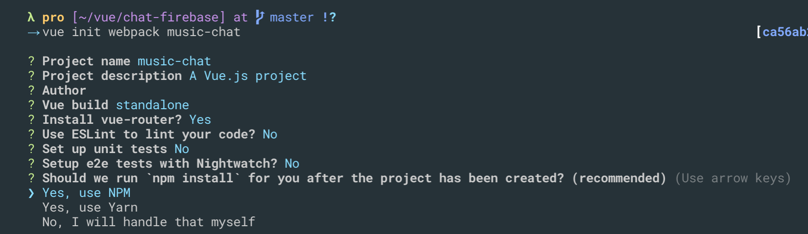
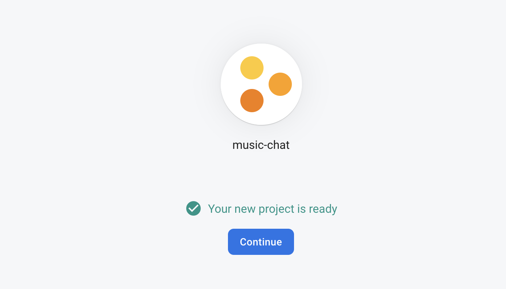
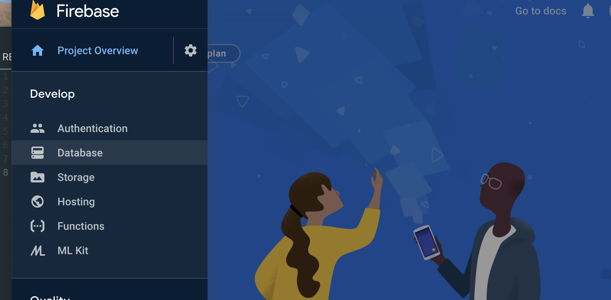
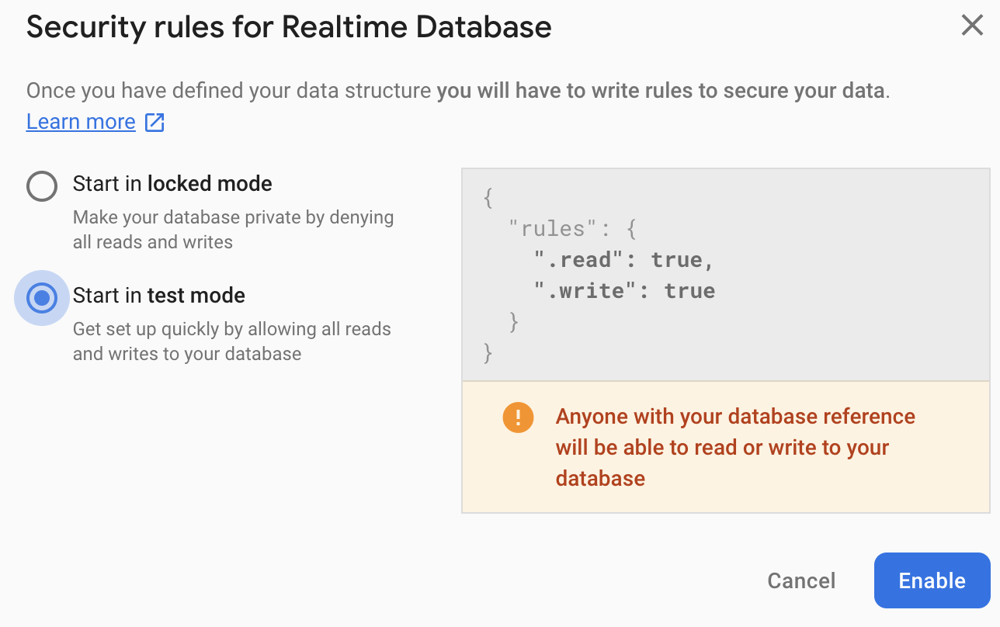
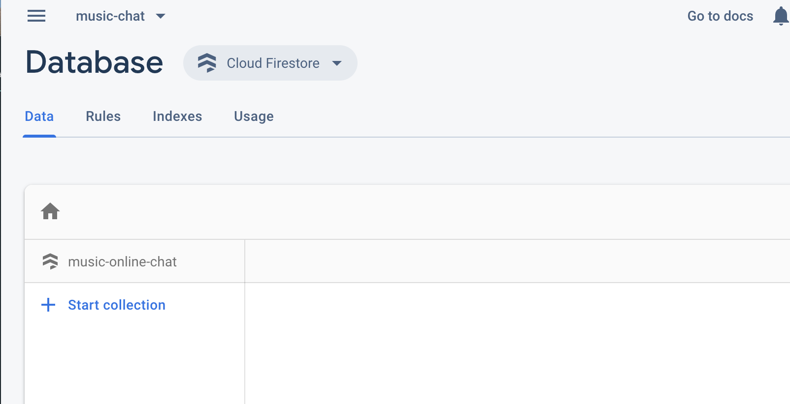
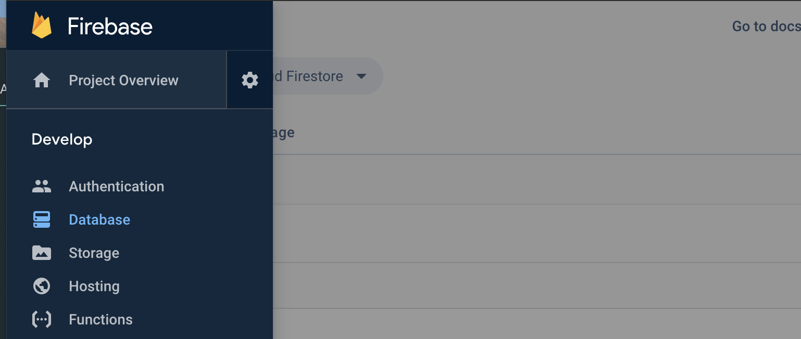
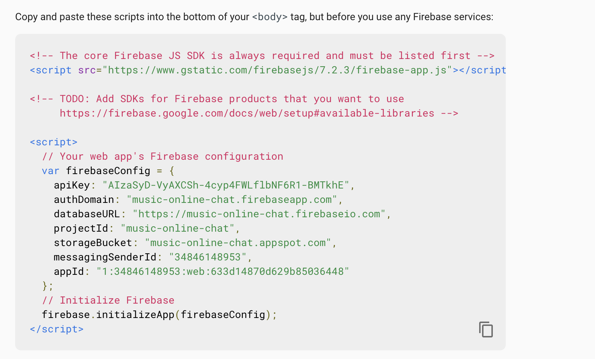

# Vue

### vue-cli
- `npm install -g @vue/cli`
---

### webpack

---
- `npm install -g @vue/cli-init`

---
- `vue init webpack music-chat`

- choose use NPM

---
firebase + online chat

- `console.firebase.google.com`
- `music-chat`

---
- click database

---

---

---
- go to Project Overview

---

- choose `web`
- copy and paste

---

