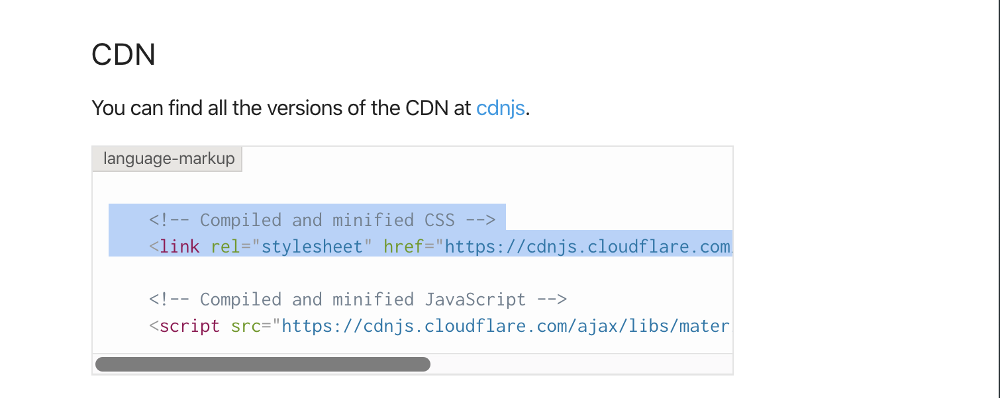
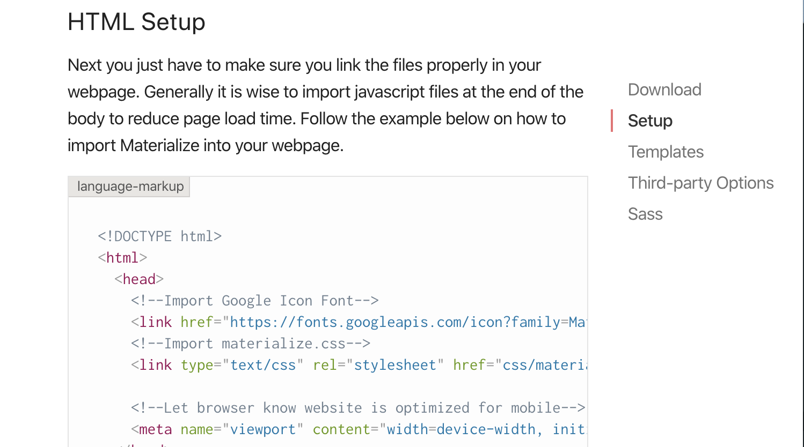
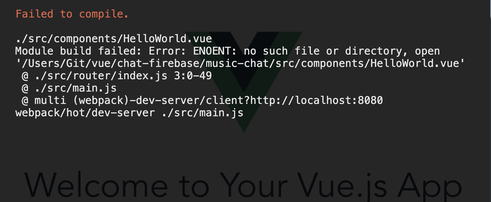
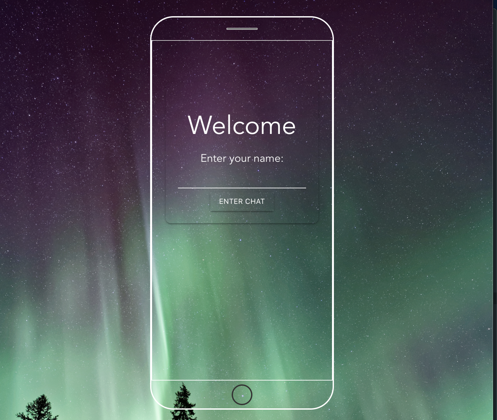

### materializecss.com
- `https://materializecss.com/getting-started.html`

- cdn
```html
    <!-- Compiled and minified CSS -->
    <link rel="stylesheet" href="https://cdnjs.cloudflare.com/ajax/libs/materialize/1.0.0/css/materialize.min.css">
```

---
- we also need google font
- go to HTML Setup
```html
<!--Import Google Icon Font-->
      <link href="https://fonts.googleapis.com/icon?family=Material+Icons" rel="stylesheet">
```

---
- update index.html
```html
<!DOCTYPE html>
<html>
  <head>
    <meta charset="utf-8">
    <meta name="viewport" content="width=device-width,initial-scale=1.0">
        <!-- Compiled and minified CSS -->
        <link rel="stylesheet" href="https://cdnjs.cloudflare.com/ajax/libs/materialize/1.0.0/css/materialize.min.css">
         <!--Import Google Icon Font-->
        <link href="https://fonts.googleapis.com/icon?family=Material+Icons" rel="stylesheet">
    <title>music-chat</title>
  </head>
  <body>
    <div id="app"></div>
    <!-- built files will be auto injected -->
  </body>
</html>
```

---

- rename components/HelloWorld.vue => Welcome.vue

---
- change the Helloworld => Welcome in `index.js`
```js
import Vue from 'vue'
import Router from 'vue-router'
import Welcome from '@/components/Welcome'

Vue.use(Router)

export default new Router({
  routes: [
    {
      path: '/',
      name: 'Welcome',
      component: Welcome
    }
  ]
})
```

---

### update welcome.vue
```html
<template>
  <div class="welcome container">
    <div class="card">
      <div class="card-content center-align">
        <h2 class="teal-text">Welcome</h2>
          <form @submit.prevent="enterChat">
            <label for="name">Enter your name:</label>
            <input type="text" name="name" v-model="name">
            <button class="btn teal">Enter Chat</button>
          </form>
      </div>
    </div>
  </div>
</template>

<script>
export default {
  name: 'Welcome',
  data () {
    return {
      name: null
    }
  },
  methods:{
    enterChat(){
      console.log(this.name)
    }
  }
}
</script>

<!-- Add "scoped" attribute to limit CSS to this component only -->
<style>
.card{
  margin-top: 80px;
  border-radius: 10px 10px 10px 10px;
  background-color: transparent;
  /* border: 2px solid rgba(0,0,0,.5); */
  /* border: 0.6px solid #ffffff; */
}
.teal-text {
    /* color: #009688 !important; */
    color: #ffffff !important;
}

.welcome{
  max-width: 400px;

}
label {
    /* font-size: .8rem; */
    /* color: #9e9e9e; */
    font-size: 1.5rem;
    color: #ffffff;
}
.teal {
    /* background-color: #009688 !important; */
    background-color: transparent !important;
    border-radius: 3px 3px 3px 3px;
    /* border: 1px solid rgba(0,0,0,.5); */
    border: 0.6px solid #ffffff;
}


input:not([type]), 
input[type=text]:not(.browser-default), 
input[type=password]:not(.browser-default), 
input[type=email]:not(.browser-default), 
input[type=url]:not(.browser-default), 
input[type=time]:not(.browser-default), 
input[type=date]:not(.browser-default), 
input[type=datetime]:not(.browser-default), 
input[type=datetime-local]:not(.browser-default), 
input[type=tel]:not(.browser-default), 
input[type=number]:not(.browser-default), 
input[type=search]:not(.browser-default), 
textarea.materialize-textarea {
    background-color: transparent;
    border: none;
    /* border-bottom: 1px solid #9e9e9e; */
    border-bottom: 0.6px solid #ffffff;
    border-radius: 0;
    outline: none;
    height: 3rem;
    width: 100%;
    font-size: 16px;
    margin: 0 0 8px 0;
    padding: 0;
    -webkit-box-shadow: none;
    box-shadow: none;
    -webkit-box-sizing: content-box;
    box-sizing: content-box;
    -webkit-transition: border .3s, -webkit-box-shadow .3s;
    transition: border .3s, -webkit-box-shadow .3s;
    transition: box-shadow .3s, border .3s;
    transition: box-shadow .3s, border .3s, -webkit-box-shadow .3s;
}

.phone{
    margin: 60px auto;
    border: 2px solid #ffffff;
    width:355px;
    height:760px;
    border-radius: 45px;
}
.speaker{
    border: 1px solid #ccc;
    width: 60px;
    height: 4px;
    margin: 20px auto;
    border-radius: 4px;
    background: #333;
}
.screen{
    /* border: 1.3px solid #333; */
    border: 1.3px solid #ffffff;
    border-top: 1.3px solid #cccccc;
    /* border-top: 1.3px solid #ffffff; */
    height: 87%;
    margin: 0 auto;
}
.home{
    border: 2px solid #333;
    width: 40px;
    height: 40px;
    margin: 7px auto;
    border-radius: 40px;
}


</style>
```

---

### import a .css
- Welcome.vue
```js
<!-- Add "scoped" attribute to limit CSS to this component only -->
<style>
@import '../assets/style/welcome.css';
</style>
```
---

